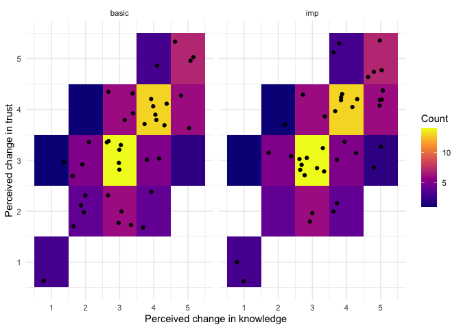

```r
library(tidyverse)     # create plots with ggplot, manipulate data, etc.
```

```
## Warning: package 'stringr' was built under R version 4.2.3
```

```r
library(broom.mixed)   # convert regression models into nice tables
library(modelsummary)  # combine multiple regression models into a single table
library(lme4)          # model specification / estimation 
library(lmerTest)      # provides p-values in the output
library(ggpubr)        # stile feature of ggplot
library(gghalves)      # do special plots in ggplot
library(kableExtra)    # for tables
```

## Import data

```r
d <- read_csv("./data/cleaned.csv")
```


```r
# overall
d %>% 
  group_by(impressiveness) %>% 
  summarise(across(c(impressed, learn, know, competence, trust), 
                   list(mean = ~mean(.)), 
                   .names = "{col}_{fn}")) %>% 
  mutate_if(is.numeric, ~round(.x, digits = 2)) %>% 
  kable() %>% 
  kable_classic(full_width = F)
```

<table class=" lightable-classic" style='font-family: "Arial Narrow", "Source Sans Pro", sans-serif; width: auto !important; margin-left: auto; margin-right: auto;'>
 <thead>
  <tr>
   <th style="text-align:left;"> impressiveness </th>
   <th style="text-align:right;"> impressed_mean </th>
   <th style="text-align:right;"> learn_mean </th>
   <th style="text-align:right;"> know_mean </th>
   <th style="text-align:right;"> competence_mean </th>
   <th style="text-align:right;"> trust_mean </th>
  </tr>
 </thead>
<tbody>
  <tr>
   <td style="text-align:left;"> basic </td>
   <td style="text-align:right;"> 3.08 </td>
   <td style="text-align:right;"> 3.28 </td>
   <td style="text-align:right;"> 3.28 </td>
   <td style="text-align:right;"> 3.17 </td>
   <td style="text-align:right;"> 3.22 </td>
  </tr>
  <tr>
   <td style="text-align:left;"> imp </td>
   <td style="text-align:right;"> 3.67 </td>
   <td style="text-align:right;"> 3.52 </td>
   <td style="text-align:right;"> 3.65 </td>
   <td style="text-align:right;"> 3.40 </td>
   <td style="text-align:right;"> 3.42 </td>
  </tr>
</tbody>
</table>


```r
# by discipline
d %>% 
  group_by(discipline, impressiveness) %>% 
  summarise(across(c(impressed, learn, competence, trust), 
                   list(mean = ~mean(.)), 
                   .names = "{col}_{fn}")) %>% 
  mutate_if(is.numeric, ~round(.x, digits = 2)) %>% 
  kable() %>% 
  kable_classic(full_width = F)
```

```
## `summarise()` has grouped output by 'discipline'. You can override using the
## `.groups` argument.
## `mutate_if()` ignored the following grouping variables:
```

<table class=" lightable-classic" style='font-family: "Arial Narrow", "Source Sans Pro", sans-serif; width: auto !important; margin-left: auto; margin-right: auto;'>
 <thead>
  <tr>
   <th style="text-align:left;"> discipline </th>
   <th style="text-align:left;"> impressiveness </th>
   <th style="text-align:right;"> impressed_mean </th>
   <th style="text-align:right;"> learn_mean </th>
   <th style="text-align:right;"> competence_mean </th>
   <th style="text-align:right;"> trust_mean </th>
  </tr>
 </thead>
<tbody>
  <tr>
   <td style="text-align:left;"> archeo </td>
   <td style="text-align:left;"> basic </td>
   <td style="text-align:right;"> 3.30 </td>
   <td style="text-align:right;"> 3.30 </td>
   <td style="text-align:right;"> 3.25 </td>
   <td style="text-align:right;"> 3.15 </td>
  </tr>
  <tr>
   <td style="text-align:left;"> archeo </td>
   <td style="text-align:left;"> imp </td>
   <td style="text-align:right;"> 3.35 </td>
   <td style="text-align:right;"> 3.25 </td>
   <td style="text-align:right;"> 3.15 </td>
   <td style="text-align:right;"> 3.45 </td>
  </tr>
  <tr>
   <td style="text-align:left;"> entom </td>
   <td style="text-align:left;"> basic </td>
   <td style="text-align:right;"> 2.85 </td>
   <td style="text-align:right;"> 3.25 </td>
   <td style="text-align:right;"> 3.10 </td>
   <td style="text-align:right;"> 3.30 </td>
  </tr>
  <tr>
   <td style="text-align:left;"> entom </td>
   <td style="text-align:left;"> imp </td>
   <td style="text-align:right;"> 4.00 </td>
   <td style="text-align:right;"> 3.80 </td>
   <td style="text-align:right;"> 3.65 </td>
   <td style="text-align:right;"> 3.40 </td>
  </tr>
</tbody>
</table>


```r
cor(d$know, d$trust)
```

```
## [1] 0.6545814
```


```r
plot_data <- d %>% 
  group_by(know, trust) %>% 
  summarise(n = n())
```

```
## `summarise()` has grouped output by 'know'. You can override using the
## `.groups` argument.
```

```r
# Plot as a tile plot
ggplot(plot_data, aes(x = know, y = trust, fill = n)) +
  geom_tile() +  # Add black border around tiles for better visibility
  geom_jitter(inherit.aes = FALSE, data = d, aes(x = know, y = trust)) +  # Scatter points within each tile
  scale_fill_viridis_c(option = "plasma") +  # Use Viridis color scale (Plasma)
  scale_x_continuous(breaks = 1:5) +
  scale_y_continuous(breaks = 1:5) +
  labs(x = "Perceived change in knowledge", 
       y = "Perceived change in trust", 
       fill = "Count") +  # Update fill legend title
  theme_minimal() +
  facet_wrap(~impressiveness)
```

<!-- -->


